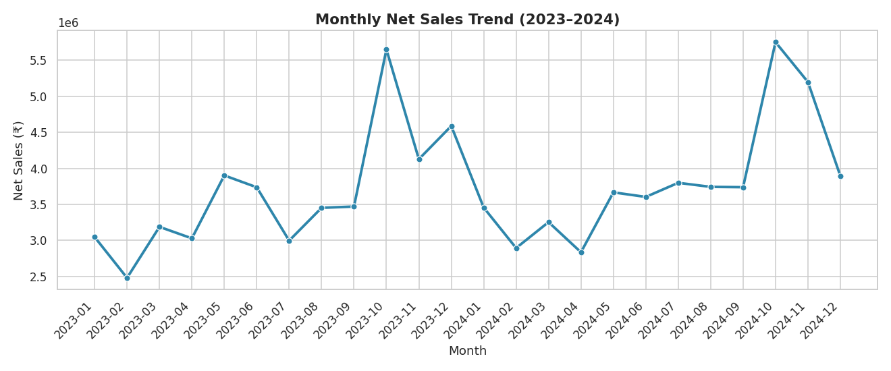

# 🛒 Retail Sales Performance & Trend Analysis

An end-to-end data analysis project examining 2 years (2023–2024) of retail transaction data to uncover sales trends, top-performing regions/categories/products, customer segment value, and the impact of discounting on profit margins — culminating in actionable business recommendations.


---

## 📌 Project Overview

Retail businesses generate large volumes of transactional data every day, but without structured analysis that data rarely translates into decisions. This project simulates a realistic retail sales dataset and walks through a complete analytics workflow — from data generation and cleaning to exploratory analysis, visualization, and business recommendations — the kind of workflow a Data Analyst would run for a retail stakeholder.

**Business questions answered:**
- How are sales trending month over month, and is there seasonality?
- Which regions, categories, and products drive the most revenue and profit?
- How much do different customer segments contribute to revenue?
- Does discounting help or hurt overall profitability?
- Are there weekly demand patterns worth planning around?

---

## 🗂️ Repository Structure

```
retail-sales-performance-analysis/
│
├── data/
│   └── retail_sales_data.csv        # 15,000-row synthetic transaction dataset
│
├── notebooks/
│   └── retail_sales_analysis.ipynb  # Full analysis notebook (executed, with charts)
│
├── src/
│   ├── generate_data.py             # Synthetic data generator
│   └── analysis.py                  # Script version of the analysis (saves charts to /images)
│
├── images/                          # Exported chart PNGs
│   ├── 01_monthly_sales_trend.png
│   ├── 02_sales_by_region.png
│   ├── 03_category_performance.png
│   ├── 04_top10_products.png
│   ├── 05_customer_segment_share.png
│   ├── 06_weekday_pattern.png
│   ├── 07_discount_vs_margin.png
│   └── 08_region_category_heatmap.png
│
├── reports/
│   └── summary_insights.md          # Auto-generated KPI + insight summary
│
├── requirements.txt
├── .gitignore
├── LICENSE
└── README.md
```

---

## 🧰 Tech Stack

| Tool | Purpose |
|---|---|
| **Python 3** | Core language |
| **Pandas / NumPy** | Data generation, cleaning, aggregation |
| **Matplotlib / Seaborn** | Data visualization |
| **Jupyter Notebook** | Exploratory analysis & storytelling |

---

## 📊 Key Insights

| Metric | Value |
|---|---|
| Total Net Sales | ₹8.95 Cr (89.5M) |
| Total Profit | ₹1.99 Cr (22.2% margin) |
| Total Orders | 15,000 |
| Average Order Value | ₹5,967 |

- **Seasonality:** Sales spike sharply in **Oct–Dec** (festive season), running 60–90% above baseline months; Jan–Feb is the seasonal low.
- **Discounting:** Profit margin erodes noticeably past the **20% discount** tier — deep discounts should be reserved for clearance, not run broadly.
- **Customer value:** **Loyal** and **Regular** segments drive the majority of revenue, pointing to a strong retention base but an opportunity to grow new-customer acquisition.
- **Weekly pattern:** Weekend (Sat/Sun) sales consistently outperform weekdays.

Full write-up with charts: [`notebooks/retail_sales_analysis.ipynb`](notebooks/retail_sales_analysis.ipynb) · Summary: [`reports/summary_insights.md`](reports/summary_insights.md)

### Sample Visualization


---

## 💡 Business Recommendations

1. **Scale up for Q4** — inventory, staffing, and marketing spend should ramp ahead of Oct–Dec given the consistent festive-season demand spike.
2. **Tighten discount policy** — cap standard promotions at 10–15%; reserve 20%+ discounts for clearance only.
3. **Invest in acquisition** — build a "New Customer" welcome campaign to grow the top of the funnel, since Loyal/Regular already convert well.
4. **Replicate the top region's playbook** — study what's driving the leading region's performance and apply those learnings elsewhere.
5. **Plan around weekend demand** — ensure adequate staffing and consider weekend-exclusive promotions.

---

## 🚀 How to Run Locally

```bash
# 1. Clone the repository
git clone https://github.com/<your-username>/retail-sales-performance-analysis.git
cd retail-sales-performance-analysis

# 2. Install dependencies
pip install -r requirements.txt

# 3. (Optional) Regenerate the dataset
python src/generate_data.py

# 4. Run the analysis script (saves charts to /images)
python src/analysis.py

# 5. Or explore interactively
jupyter notebook notebooks/retail_sales_analysis.ipynb
```

---

## 👤 About Me

**Shravan** — Aspiring Data Analyst | Python · SQL · Power BI · Excel
Currently pursuing an MSc in Data Science (AlmaBetter × Woolf University).

📫 Connect with me on [LinkedIn](#) · [GitHub](#)

---

*Note: This dataset is synthetically generated for portfolio/demonstration purposes and does not represent any real company's data.*
